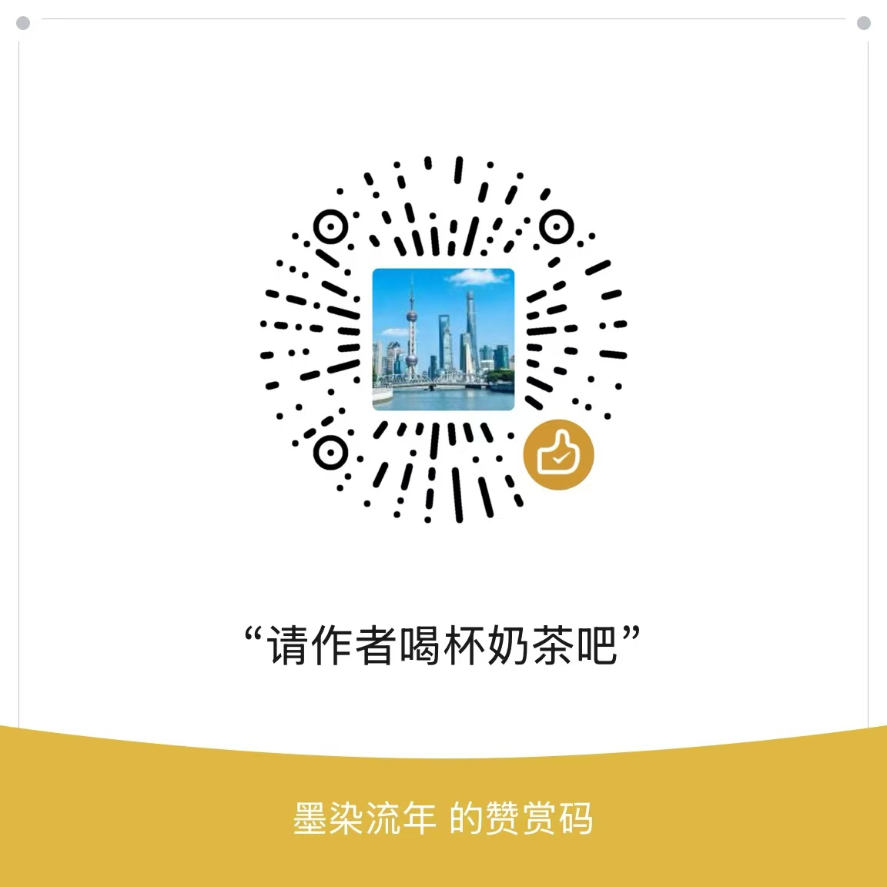

# 一、思路

1. 通过调用如下接口来实现增加播放量:
   - `https://www.douyin.com/aweme/v2/web/aweme/stats/`
2. 该接口里要带上 cookie，一种是使用实名的 cookie，另一种是使用匿名的 cookie（游客 cookie）；
3. 游客 cookie 的生成方式：
   - 随机生成 `ttwid`，`msToken`，`webid`，`__ac_nonce`，`__ac_signature`，`biz_trace_id` 等字段，拼凑形成 cookie。

# donate

如果该项目对您有帮助，欢迎微信打赏

